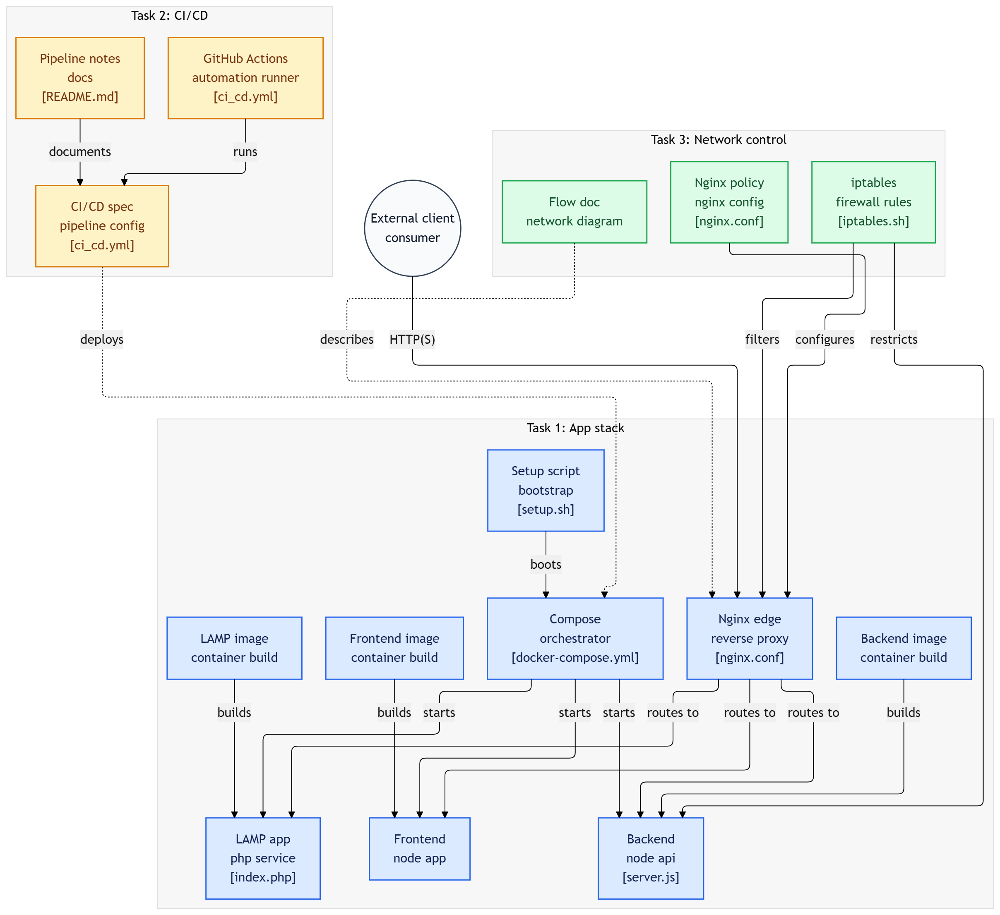

# Reverse Proxy Project

## 📌 Overview
  
This project implements an end-to-end CI/CD pipeline for a multi-service web application using GitHub Actions and AWS. The pipeline automates building, testing, containerization, and deployment to an EC2 instance using Docker.

The application consists of:

- **Frontend**: React application
- **Backend**: Node.js API
- **LAMP Stack**: Apache/PHP service
- **Databases**: MongoDB and MySQL (internal)

The system uses Nginx as a reverse proxy to route traffic between services.

## 🏗️ Architecture

The architecture follows this flow:

```
GitHub (code push)
→ GitHub Actions (build, test, push images)
→ API Gateway (HTTP endpoint)
→ AWS Lambda (trigger deployment)
→ EC2 instance (Docker host)
→ Docker Compose (runs services)
→ Nginx (reverse proxy)
→ Application accessible via browser
```

### Network Flow

```
IoT Device
   │ (BLE)
   ▼
BLE Gateway
   │
   ▼
NGINX (Reverse Proxy)
   │
   ├── /app → Frontend (React)
   ├── /api → Backend (Node.js)
   └── /legacy → Apache (PHP)
   │
   ▼
Databases
   ├── MongoDB (27017)
   └── MySQL (3306)
```



## 📁 Project Structure

```
DevOps-Project-04/
│
├── backend/
│   ├── Dockerfile
│   ├── package.json
│   └── server.js
│
├── frontend/
│   ├── Dockerfile
│   ├── package.json
│   └── (React app files)
│
├── lamp/
│   ├── Dockerfile
│   └── index.php
│
├── docker-compose.yml
├── nginx.conf
├── deploy.sh
├── lambda_function.py
├── iptables.sh
├── network-flow
├── diagram.png
└── README.md
```

## 🛠️ Prerequisites

Before running this project, ensure you have the following installed:

- Docker and Docker Compose
- Node.js (for local development)
- Git
- AWS Account (for deployment)
- Docker Hub Account

### AWS Resources Needed:
- EC2 Instance (t2.micro recommended)
- API Gateway
- Lambda Function
- IAM Roles and Policies

## 🚀 Installation and Setup

### Local Development

1. **Clone the repository:**
   ```bash
   git clone <repository-url>
   cd DevOps-Project-04
   ```

2. **Build and run the services:**
   ```bash
   docker-compose up --build
   ```

3. **Access the application:**
   - Frontend: http://localhost/app/
   - Backend API: http://localhost/api
   - LAMP App: http://localhost/legacy

### Docker Hub Setup

1. Create a Docker Hub account
2. Login locally:
   ```bash
   docker login
   ```
3. Build and push images:
   ```bash
   docker-compose build
   docker tag reverse-proxy-project_backend <your-dockerhub-username>/backend
   docker tag reverse-proxy-project_frontend <your-dockerhub-username>/frontend
   docker tag reverse-proxy-project_apache <your-dockerhub-username>/lamp
   docker push <your-dockerhub-username>/backend
   docker push <your-dockerhub-username>/frontend
   docker push <your-dockerhub-username>/lamp
   ```

## ☁️ Deployment to AWS

### 1. EC2 Instance Setup

1. Launch a t2.micro EC2 instance with Ubuntu
2. Open ports 22 (SSH) and 80 (HTTP) in security group
3. SSH into the instance:
   ```bash
   ssh -i your-key.pem ubuntu@<ec2-public-ip>
   ```

4. Install Docker:
   ```bash
   sudo apt update
   sudo apt install docker.io -y
   sudo usermod -aG docker ubuntu
   ```

5. Copy deployment files to EC2:
   - `docker-compose.yml`
   - `nginx.conf`
   - `deploy.sh`

6. Make deploy.sh executable:
   ```bash
   chmod +x deploy.sh
   ```

### 2. API Gateway Setup

1. Create an HTTP API in AWS API Gateway
2. Create a route: POST /deploy
3. Integrate with Lambda function

### 3. Lambda Function Setup

1. Create a Lambda function with Python runtime
2. Add paramiko layer for SSH
3. Set environment variables:
   - `EC2_HOST`: Your EC2 public IP
   - `EC2_USER`: ubuntu
   - `EC2_KEY`: Your private key (handle newlines properly)

4. Upload the `lambda_function.py` code

### 4. GitHub Actions Setup

1. Add secrets to your GitHub repository:
   - `DOCKER_USERNAME`
   - `DOCKER_PASSWORD`
   - `API_GATEWAY_URL`

2. The workflow will:
   - Build Docker images
   - Push to Docker Hub
   - Trigger deployment via API Gateway

### 5. Deploy

1. Push code to the main branch
2. GitHub Actions will automatically deploy
3. Access your application at: http://<ec2-public-ip>

## 🔧 Configuration

### Nginx Configuration

The `nginx.conf` file routes traffic:
- `/app` → Frontend (port 80)
- `/api` → Backend (port 5000)
- `/legacy` → LAMP (port 8080)

### Docker Compose

Services defined:
- `nginx`: Reverse proxy
- `frontend`: React app
- `backend`: Node.js API
- `apache`: PHP app
- `mysql`: Database
- `mongodb`: Database

## 🔒 Security

Basic security measures:
- Firewall rules in `iptables.sh` (blocks direct DB access)
- Nginx rate limiting (10 req/sec per IP)
- Internal database access only

## 🧪 Testing

### Local Testing

```bash
# Test backend API
curl http://localhost/api

# Test frontend
curl http://localhost/app/

# Test LAMP
curl http://localhost/legacy
```

### CI/CD Testing

GitHub Actions includes:
- Backend API tests
- Frontend build tests
- Code quality checks with SonarQube

## 🐛 Troubleshooting

### Common Issues

1. **Docker permission denied**: Run `sudo usermod -aG docker $USER` and restart
2. **Port already in use**: Change ports in `docker-compose.yml`
3. **Lambda timeout**: Increase timeout in Lambda configuration
4. **SSH connection failed**: Check security group and key permissions
5. **Images not pulling**: Ensure Docker Hub credentials are correct

### Logs

```bash
# View container logs
docker-compose logs

# View specific service logs
docker-compose logs backend
```

## 🚀 Usage

Once deployed:

1. Access the main application: http://<ec2-ip>/app/
2. API endpoints: http://<ec2-ip>/api
3. Legacy app: http://<ec2-ip>/legacy

## 🤝 Contributing

1. Fork the repository
2. Create a feature branch
3. Make changes and test locally
4. Push to your fork
5. Create a Pull Request

## 📄 License

This project is for educational purposes.

## 🔗 References

- [Docker Documentation](https://docs.docker.com/)
- [AWS Lambda Guide](https://docs.aws.amazon.com/lambda/)
- [GitHub Actions](https://docs.github.com/en/actions)
- [Nginx Reverse Proxy](https://docs.nginx.com/nginx/admin-guide/web-server/reverse-proxy/)
